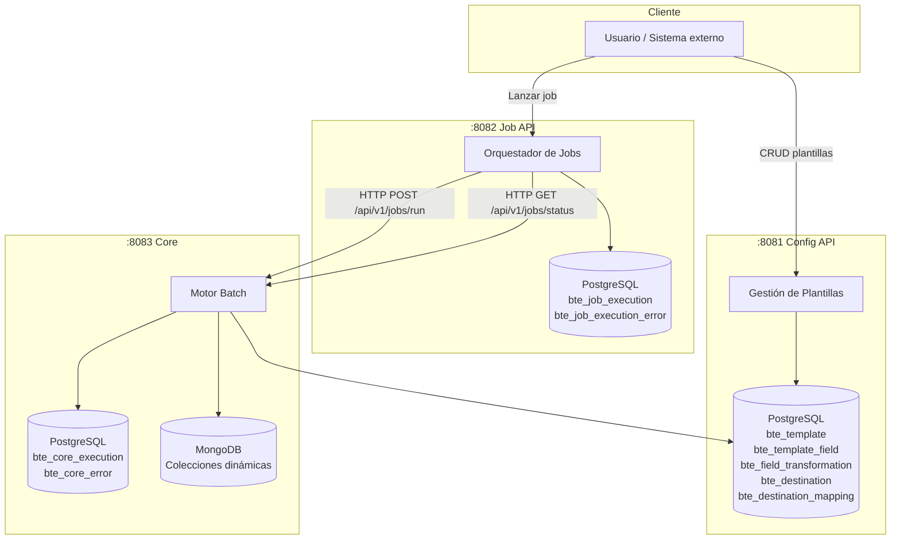
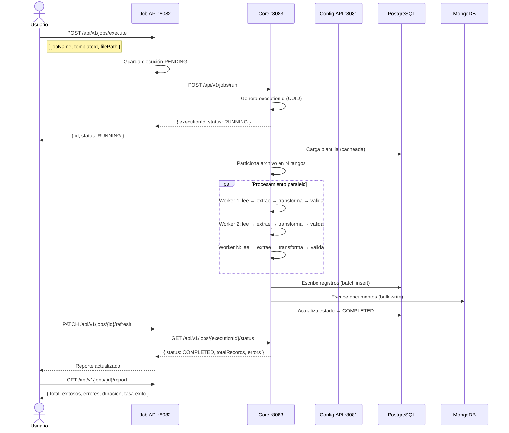

# Batch Engine — Motor de Procesamiento Batch Configurable

Sistema distribuido de procesamiento batch para archivos TXT de gran volumen, basado en Spring Batch. Permite configurar plantillas, campos, transformaciones y destinos sin modificar código.

---

## ¿Qué problema resuelve?

Procesar archivos TXT masivos (millones de registros) de forma configurable, paralela y extensible — sin escribir código nuevo para cada caso de uso. Todo el comportamiento se configura a través de una API REST.

---

## Arquitectura General



---

## Proyectos

El sistema está compuesto por 3 microservicios independientes:

### 1. `config-api` — Puerto 8081

Administra toda la configuración del motor batch. Permite definir cómo se debe leer, interpretar y escribir cada archivo.

**Responsabilidades:**
- CRUD de plantillas de procesamiento
- Definición de campos por plantilla
- Configuración de cadenas de transformación por campo
- Configuración de destinos de escritura y sus mappings

**Swagger:** `http://localhost:8081/swagger-ui.html`

---

### 2. `engine-core-api` — Puerto 8082 (Job API)

Punto de entrada para lanzar y monitorear ejecuciones. Actúa como orquestador — recibe la solicitud, llama al core y expone el estado al usuario.

**Responsabilidades:**
- Recibir solicitudes de ejecución de jobs
- Delegar el procesamiento al core via Feign
- Persistir el historial de ejecuciones
- Exponer estado, errores y reportes de cada ejecución

**Swagger:** `http://localhost:8082/swagger-ui.html`

---

### 3. `engine-core-job` — Puerto 8083 (Core)

El motor real. Es el único que toca los archivos, transforma datos y escribe en los destinos. No expone endpoints públicos — solo recibe llamadas del job-api.

**Responsabilidades:**
- Leer archivos TXT por streaming (sin cargar en memoria)
- Particionar el archivo para procesamiento paralelo
- Extraer campos (longitud fija o delimitado)
- Aplicar cadenas de transformaciones configurables
- Validar campos obligatorios y tipos
- Escribir en múltiples destinos (PostgreSQL, MongoDB, Kafka, File)
- Registrar errores línea por línea
- Exponer estado de ejecución al job-api

**Swagger:** `http://localhost:8083/swagger-ui.html`

---

## Flujo completo de una ejecución



---

## Endpoints

### Config API — `http://localhost:8081`

| Método | Endpoint | Descripción |
|--------|----------|-------------|
| POST | `/api/v1/templates` | Crear plantilla |
| GET | `/api/v1/templates` | Listar plantillas |
| GET | `/api/v1/templates/{id}` | Obtener plantilla |
| GET | `/api/v1/templates/{id}/complete` | Plantilla con campos y destinos |
| PUT | `/api/v1/templates/{id}` | Actualizar plantilla |
| DELETE | `/api/v1/templates/{id}` | Eliminar plantilla |
| POST | `/api/v1/templates/{id}/fields` | Agregar campo |
| GET | `/api/v1/templates/{id}/fields` | Listar campos |
| PUT | `/api/v1/templates/{id}/fields/{fieldId}` | Actualizar campo |
| DELETE | `/api/v1/templates/{id}/fields/{fieldId}` | Eliminar campo |
| POST | `/api/v1/templates/{id}/fields/{fieldId}/transformations` | Agregar transformación |
| DELETE | `/api/v1/templates/{id}/fields/{fieldId}/transformations/{tid}` | Eliminar transformación |
| PATCH | `/api/v1/templates/{id}/fields/{fieldId}/transformations/reorder` | Reordenar transformaciones |
| POST | `/api/v1/templates/{id}/destinations` | Agregar destino |
| GET | `/api/v1/templates/{id}/destinations` | Listar destinos |
| PUT | `/api/v1/templates/{id}/destinations/{destId}` | Actualizar destino |
| DELETE | `/api/v1/templates/{id}/destinations/{destId}` | Eliminar destino |
| POST | `/api/v1/templates/{id}/destinations/{destId}/mappings` | Agregar mapping |
| DELETE | `/api/v1/templates/{id}/destinations/{destId}/mappings/{mid}` | Eliminar mapping |

---

### Job API — `http://localhost:8082`

| Método | Endpoint | Descripción |
|--------|----------|-------------|
| POST | `/api/v1/jobs/execute` | Lanzar un job |
| GET | `/api/v1/jobs` | Historial de ejecuciones |
| GET | `/api/v1/jobs?status=RUNNING` | Filtrar por estado |
| GET | `/api/v1/jobs/{id}` | Detalle de ejecución |
| PATCH | `/api/v1/jobs/{id}/refresh` | Sincronizar estado con el core |
| GET | `/api/v1/jobs/{id}/errors` | Errores de la ejecución |
| GET | `/api/v1/jobs/{id}/report` | Reporte final |

---

### Core — `http://localhost:8083` (API interna)

| Método | Endpoint | Descripción |
|--------|----------|-------------|
| POST | `/api/v1/jobs/run` | Lanzar job (llamado por job-api) |
| GET | `/api/v1/jobs/{executionId}/status` | Estado de ejecución |
| GET | `/api/v1/jobs/available` | Jobs registrados |
| GET | `/api/v1/jobs` | Todas las ejecuciones |

---

## Transformaciones disponibles

Las transformaciones se configuran por campo desde la plantilla. Se ejecutan en cadena según el `orderIndex`.

| Nombre | Descripción | Parámetros |
|--------|-------------|------------|
| `trim` | Elimina espacios al inicio y fin | — |
| `uppercase` | Convierte a mayúsculas | — |
| `lowercase` | Convierte a minúsculas | — |
| `removeLeadingZeros` | Elimina ceros a la izquierda | — |
| `toInteger` | Convierte a entero | — |
| `toLong` | Convierte a long | — |
| `parseDate` | Parsea fecha con formato de entrada y salida | `inputFormat`, `outputFormat` |
| `formatDate` | Formatea una fecha ISO a otro formato | `outputFormat` |
| `replace` | Reemplaza texto | `target`, `replacement` |
| `regexReplace` | Reemplaza con expresión regular | `pattern`, `replacement` |
| `formatRut` | Formatea RUT chileno | `format`: `POINTS_DASH`, `DASH_ONLY`, `CLEAN` |

---

## Destinos soportados

| Tipo | Descripción | Config requerida |
|------|-------------|------------------|
| `POSTGRESQL` | Tabla con columnas dinámicas | `targetTable` |
| `MONGODB` | Colección con campos dinámicos | `targetCollection` |
| `KAFKA` | Topic configurable | `targetTopic` |
| `FILE` | Archivo de salida delimitado | `targetPath` |
| `REST` | Endpoint HTTP | `targetUrl` |

---

## Tipos de archivo soportados

| Tipo | Descripción | Config requerida |
|------|-------------|------------------|
| `FIXED` | Longitud fija por campo | `position` + `length` por campo |
| `DELIMITED` | Separado por delimitador | `separator` en la plantilla |

### Separadores soportados
`|` `\t` `TAB` `;` `,` `/` o cualquier otro configurable

---

## Rendimiento estimado

Procesando un archivo de 15 millones de líneas en hardware modesto (4 cores, SSD, BD local):

| Configuración | Tiempo estimado |
|---------------|-----------------|
| 1 hilo, chunk 500 | ~45-60 min |
| 4 hilos, chunk 1000 | ~12-15 min |
| 8 hilos, chunk 2000 | ~6-8 min |
| 8 hilos, chunk 5000 | ~4-5 min |

Configuración por defecto del core: **8 particiones, chunk de 1000 registros**.

---

## Stack tecnológico

| Capa | Tecnología |
|------|------------|
| Framework batch | Spring Batch 5 |
| Framework web | Spring Boot 3.5 |
| Persistencia relacional | Spring Data JPA + PostgreSQL |
| Persistencia documental | Spring Data MongoDB |
| Comunicación entre servicios | OpenFeign |
| Caché de plantillas | Caffeine |
| Migraciones BD | Liquibase |
| Documentación API | SpringDoc OpenAPI (Swagger) |
| Lenguaje | Java 17 |
| Build | Maven |
| Infraestructura local | Docker + Docker Compose |

---

## Requisitos

- Java 17+
- Maven 3.8+
- Docker + Docker Compose

---

## Levantar el sistema

### 1. Iniciar infraestructura

```bash
docker-compose up -d
```

Esto levanta:
- PostgreSQL en `localhost:5432`
- MongoDB en `localhost:27017`

### 2. Crear la base de datos

```bash
docker exec -it batch-engine-postgres psql -U postgres -c "CREATE DATABASE batch_engine;"
```

### 3. Levantar los servicios en orden

```bash
# Terminal 1
cd config-api && ./mvnw spring-boot:run

# Terminal 2 — esperar que config-api levante
cd engine-core-job && ./mvnw spring-boot:run

# Terminal 3 — esperar que core levante
cd engine-core-api && ./mvnw spring-boot:run
```

### 4. Verificar

```bash
curl http://localhost:8081/actuator/health
curl http://localhost:8083/actuator/health
curl http://localhost:8082/actuator/health
```

---

## Estructura del proyecto

```
Springbatch/
├── docker-compose.yml
├── config-api/               → Puerto 8081 — Administración de plantillas
├── engine-core-job/          → Puerto 8083 — Motor batch (core)
└── engine-core-api/          → Puerto 8082 — Orquestador de jobs
```

---

## Agregar un nuevo Job

Solo crear una clase que implemente `BatchJobDefinition` en el core:

```java
@Component
public class MiNuevoJob implements BatchJobDefinition {

    @Override
    public String getJobName() {
        return "miNuevoJob";
    }

    @Override
    public Job buildJob(JobRunRequest request, String executionId) {
        // definir steps propios
    }
}
```

El `BatchJobRegistry` lo detecta automáticamente. El job-api no necesita cambios.

---

## Agregar una nueva Transformación

Solo crear un bean que implemente `FieldTransformer` en el core:

```java
@Component
public class MiTransformer implements FieldTransformer {

    @Override
    public String getName() {
        return "miTransformacion";
    }

    @Override
    public String transform(String value, Map<String, String> parameters) {
        // lógica de transformación
        return value;
    }
}
```

El `TransformerRegistry` lo detecta automáticamente. No hay que modificar nada más.
